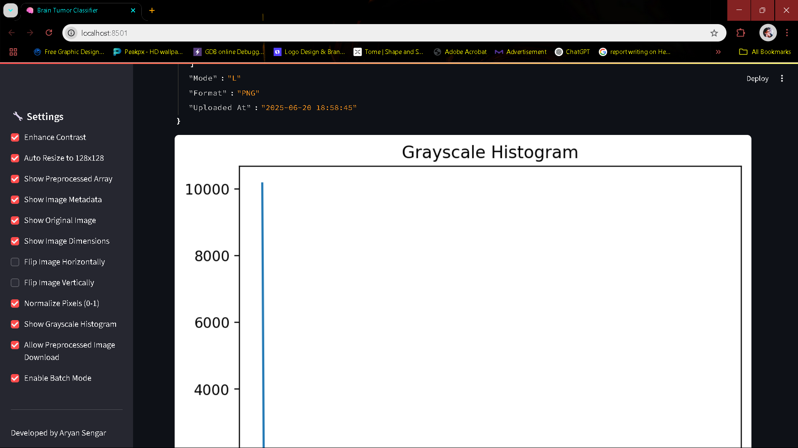

# 🧠 Brain Tumor Classification Using Deep Learning
*A Streamlit-based AI Tool for Medical Image Diagnosis*

## 📌 Description
This project is a deep learning-powered web application for classifying brain MRI/CT images as **Healthy** or **Tumor**. It uses a Convolutional Neural Network (CNN) trained on medical images and provides an intuitive Streamlit interface with support for batch classification, contrast enhancement, and downloadable diagnostic reports in PDF format.

---

## 🚀 Features
- 🧠 Classifies brain images using a trained CNN model
- 📊 Displays prediction confidence and class probabilities
- 🖼️ Shows original vs. preprocessed images
- 🧾 Auto-generates PDF reports with metadata, histograms, and prediction summaries
- 📁 Batch mode: Upload a ZIP of images and download CSV results
- 📚 View prediction history and model architecture summary

---

## 🖥️ Demo Screenshots
 
 # Dashboard 
 
 
 

 # Classification Result
 
 
 
 
 
 
 
 
 

 # Generated File
 
 
 
 
 
 
 
---

## 🧪 Tech Stack & Libraries

- `Python 3.10`
- `TensorFlow / Keras`
- `Streamlit`
- `Pillow (PIL)`
- `Matplotlib`, `Seaborn`
- `FPDF`
- `NumPy`, `Pandas`
- `OpenCV`, `Scikit-learn`

---

## 🎯 Future Improvements

Multiclass tumor detection (glioma, meningioma, pituitary)

DICOM format support

Cloud deployment (e.g., Hugging Face, Streamlit Cloud)

Heatmap overlays (Grad-CAM)

Patient form integration and database storage

---

## 📦 Model Not Included 
To run the app, download the trained model file from:  
[Google Drive Link](https://drive.google.com/file/d/1yshagIhfq15iDHo_0-3SRw33lavghMiT/view?usp=sharing)

Then place it in the project directory as `brain_tumor_model.h5`.
